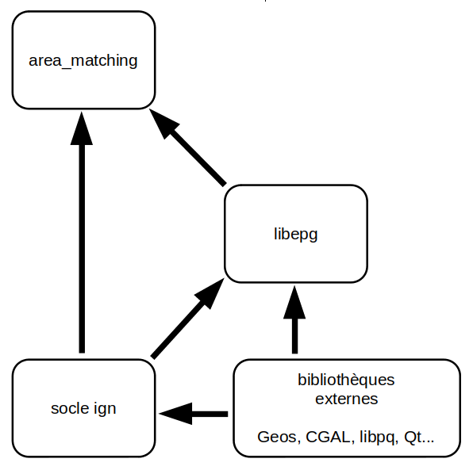
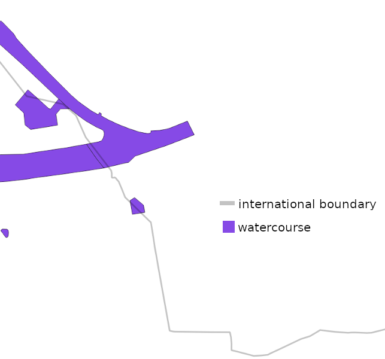
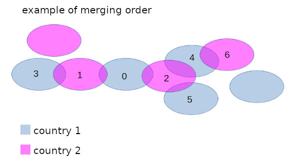
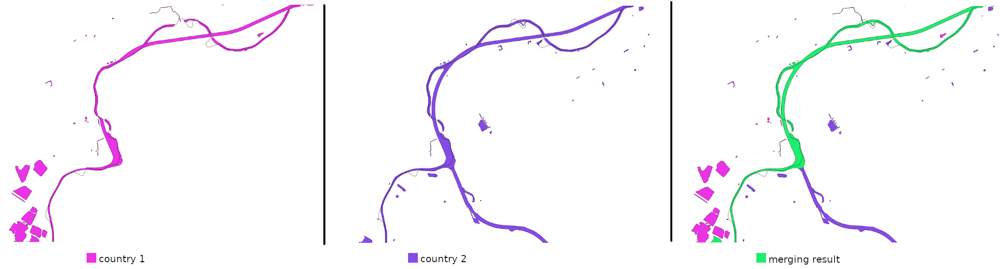

# Introduction

La présente documentation, à destination des développeurs, a pour objectif de présenter le détail du fonctionnement du processus de mise en cohérences des surfaciques aux frontières ainsi que les principaux outils mis en oeuvre.

# Installation

## Code source 

Le code source de l'application est disponible sur le dépôt https://github.com/openmapsforeurope2/area_matching.git

## Dépendances 

L'installation de l'application nécessite la compilation préalable de bibliothèques internes et externes à l'IGN.

Voici le graphe des dépendances :



### Socle IGN 

Le socle logiciel de l'IGN regroupe un ensemble de bibliothèques développées en interne qui permettent d'unifier l'accès aux bibliothèques c++ de traitement et de stockage de données géographiques.
On y trouve notamment des modèles de données pivots (géométries, objet attributaire), des fonctions de lecture/écriture de conteneurs d'objets, des opérations sur les géométries, de nombreux algorithmes et outils spécifiquement conçus pour répondre à des problématiques géomaticiennes...

Le code source du socle ce trouve sur le dépôt https://codes-ign.ign.fr/svn/sd-socle/trunk

### LibEPG 

Cette bibliothèque, développée à l'IGN et s'appuyant essentiellement sur le socle logiciel, contient de nombreux algorithmes et fonctions utilitaires dédiés spécifiquement aux besoins des produits européens (EGM/ERM) ainsi qu'au projet [OME2](https://github.com/openmapsforeurope2/OME2).
Elle comporte essentiellement des fonctions de généralisations, des fonctions utiles au management du processus tels que des utilitaires de log, d'orchestration, de gestion du contexte).
On y trouve également des opérateurs permettant d'encapsuler des objets géométriques complexes afin d'en optimiser la manipulation (par l'utilisation de graphes, d'indexes...) et ainsi d'accroitre les performances globales des processus.

Le code source de la bibliothèque libepg ce trouve sur le dépôt http://gitlab.dockerforge.ign.fr/europe/libepg.git 


# Configuration

L'outil s'appuie sur de nombreux paramètres de configuration permettant d'adapter le comportement des algorithmes en fonctions des spécificités nationales (sémantique, précision, échelle, conventions de modélisation...).

On trouve dans le [dossier de configuration](https://github.com/openmapsforeurope2/area_matching/tree/main/config) les fichiers suivants :

- epg_parameters.ini : regroupe des paramètres de base issus de la bibliothèque libepg qui constitue le socle de développement l'outil. Ce fichier est aussi le fichier chapeau qui pointe vers les autres fichiers de configurations.
- db_conf.ini : informations de connexion à la base de données.
- theme_parameters.ini : configuration des paramètres spécifiques à l'application.


# Fonctionnement du processus

Le traitement de mise en cohérence des objets surfacique est lancé pour un couple de pays frontaliers.

## Etapes préliminaires

Les données sur lesquelles ce traitement est lancé doivent avoir été nettoyées en amont à l'aide de l'outil **clean** du projet [data-tools](https://github.com/openmapsforeurope2/data-tools) qui permet de supprimer les surfaces ou portions de surfaces trop éloignées de leur pays.
Cet outil doit être utilisé sur des tables de travail dans lesquelles sont extraites les données des deux pays à traiter autour de leur frontière commune.

## Principe général du traitement

Le processus de mise en cohérence des surfaces est décomposé en une succession d'étapes clés.
Afin d'orchestrer l'enchainement de ces étapes l'application utilise l'outil **epg::step::StepSuite** de la bibliothèque **libepg**. Ce dernier permet de lancer une succession de **epg::step::Step** dans lesquels sont décrits les traitements de chaque étape.
Les traitements de chaque étape sont lancés sur une ou plusieurs tables de travail dédiées, préfixées du numéro de l'étape. A l'initialisation d'un **epg::step::Step** (étape) chaque table de travail est copiée à partir de la table de travail d'une étape précédente (qui n'est pas nécessairement l'étape immédiatement antérieure, car toutes les étapes ne travaillent pas sur les mêmes données).

Les étapes qui composent le traitement de mise en cohérence sont les suivantes :

301. import dans la table de travail des objets de type 'standing water'
310. génération des 'cutting lines'
320. suppression des surfaces hors pays
330. nettoyage des 'cutting lines' orphelines
334. génération de surfaces par intersection des surfaces des deux pays. Ces surfaces sont stockées dans une table dédiée.
335. génération des 'cutting point'
340. fusion des surfaces des deux pays présentant des zones de chevauchement
350. découpe des surfaces fusionnées avec les 'cutting lines' et les sections générées à partir des 'cutting point'
360. affectation des attributs aux surfaces résultant de la fusion/découpe
370. agrégation des surfaces issues de la fusion/découpe
399. export des surfaces de type 'standing water'

L'outil **epg::step::StepSuite** donne la possibilité de ne lancer que certaines étapes ou une plage de plusieurs étapes.

## Lancement du traitement

Exemple de lancement du traitement complet sur les pays France (code pays 'fr') et Belgique (code pays 'be') :
```
area_matching --c path/to/config/epg_parameters.ini --cc be#fr
```
A noter que l'on renseigne pour le paramètre --cc le code de la frontière séparant les deux pays à traiter. Le code pays est toujours composé de la même manière, c'est à dire en concaténant les codes <u>par ordre alphabétique</u>.

Exemple du lancement d'une seule étape :
```
area_matching --c path/to/config/epg_parameters.ini --cc be#fr --sp 340
```

Exemple de lancement d'une plage d'étapes :
```
area_matching --c path/to/config/epg_parameters.ini --cc be#fr --sp 340-370
```
Ici toutes les étapes de 340 à 370 (incluses) sont jouées.


## Les étapes - fonctionnement détaillé

### 301 : AddStandingWater

Les objets de la table de travail des _'standing waters'_ des deux pays sont copiés dans la table de travail des _'watercourse areas'_. Les objets copiés sont supprimés de la table des _'standing waters'_.


#### Données de travail :

| table                          | entrée | sortie | entitée de travail | description                                                 |
|--------------------------------|--------|--------|--------------------|-------------------------------------------------------------|
| AREA_TABLE_INIT                | X      | X      | X                  | table des surfaces à traiter                                |
| AREA_TABLE_INIT_STANDING_WATER | X      | X      | X                  | table des surfaces à exporter vers la table AREA_TABLE_INIT |


#### Principaux opérateurs de calcul utilisés :
- app::calcul::StandingWaterOp

#### Description du traitement :
Paramètre utilisés: 
| paramètre                       | description                                                                                        |
|---------------------------------|----------------------------------------------------------------------------------------------------|
| IS_STANDING_WATER_NAME          | nom du champ indiquant si l'objet est de type 'standing water'                                     |

Un champ _IS_STANDING_WATER_NAME_ de type _character varying(255)_ est ajouté à la table _AREA_TABLE_INIT_ et renseigné pour chaque objet importé depuis la table _AREA_TABLE_INIT_STANDING_WATER_. Chaque objet importé dans la table _AREA_TABLE_INIT_ est supprimé de la table _AREA_TABLE_INIT_STANDING_WATER_.

### 310 : GenerateCuttingLines

Le but est de générer les _'cutting lines'_. Une _'cutting line'_ est une portion de contour partagée par deux polygones d'un même pays.

#### Données de travail :

| table           | entrée | sortie | entitée de travail | description                  |
|-----------------|--------|--------|--------------------|------------------------------|
| AREA_TABLE_INIT | X      | X      | X                  | table des surfaces à traiter |
| CUTL_TABLE      |        | X      |                    | table des 'cutting lines'    |

Note : la table en sortie _CUTL_TABLE_ n'est pas préfixée du numéro d'étape (elle sert de référence pour l'ensemble du processus)

La table _CUTL_TABLE_ dans laquelle sont enregistrées les 'cutting lines' est effacée si elle existe déjà puis créée.
Sa structure est la suivante:

| champ             | type                   |
|-------------------|------------------------|
| COUNTRY_CODE      | character varying(8)   |
| LINKED_FEATURE_ID | character varying(255) |
| GEOM              | LineStringZ            |


#### Principaux opérateurs de calcul utilisés :
- app::calcul::StandingWaterOp

#### Description du traitement :
Le traitement est réalisé pays par pays. Le principe consiste à construire un graphe planaire à partir de tous les contours des polygones d'un pays. On parcourt ensuite les arcs du graphe est on identifie les arcs possédant plusieurs origines puisqu'ils correspondent à des portions de contours partagées. les arcs adjacents possédant les mêmes origines sont fusionnés. Ce sont ces arcs fusionnés qui constituent les futures sections de découpage et qui sont enregistrés dans la table des _'cutting lines'_.


### 320 : CleanByLandmask

L'objectif de cette étape est de supprimer les surfaces et portions de surfaces trop éloignées de leur pays.

#### Données de travail :

| table                 | entrée | sortie | entitée de travail | description                   |
|-----------------------|--------|--------|--------------------|-------------------------------|
| AREA_TABLE_INIT       | X      | X      | X                  | table des surfaces à traiter  |
| TARGET_BOUNDARY_TABLE | X      |        |                    | table des frontières          |
| LANDMASK_TABLE        | X      |        |                    | table des emprises nationales |

#### Principaux opérateurs de calcul utilisés :
- app::calcul::PolygonSplitterOp
- app::calcul::PolygonCleanerOp
- app::calcul::PolygonMergerOp

#### Description du traitement :
##### 1) Découpe des surface

Paramètres utilisés: 
| paramètre              | description                                                                |
|------------------------|----------------------------------------------------------------------------|
| LAND_COVER_TYPE_NAME   | nom du champ designant le type de couverture du sol                        |
| LAND_COVER_TYPE_VALUE  | valeur pour le type de couverture de sol                                   |
| PS_BORDER_OFFSET       | distance de décalage de la géométrie de découpe par rapport à la frontière |


Les surfaces débordant de leur pays sont découpées suivant un ensemble de linéaires correspondant aux frontières internationnales décalées d'une certaine distance vers l'exterieur du pays.


Afin d'optimiser les calculs, la géométrie de découpe, parcourant l'intégralité du contour du pays, est indexée (ses segments sont indexés dans le quadtree de la classe **epg::tools::geometry::SegmentIndexedGeometry**). Ainsi lorsque l'on souhaite réaliser la découpe d'un polygone, on récupère tout d'abord l'ensemble des segments de découpe situés dans sa boite englobante, puis on utilise uniquement ces segments comme géométrie de découpe (la découpe est réalisée à l'aide de la classe **epg::tools::geometry::PolygonSplitter**)


##### 2) Suppression des surfaces hors pays

Paramètres utilisés: 
| paramètre              | description                                           |
|------------------------|-------------------------------------------------------|
| LAND_COVER_TYPE_NAME   | nom du champ désignant le type de couverture du sol   |
| LAND_COVER_TYPE_VALUE  | valeur pour le type de couverture de sol              |
| PC_DISTANCE_THRESHOLD  | seuil d'éloigenement minimum des surfaces à supprimer |


L'objectif est ici de supprimer les surfaces hors de leur pays qui s'éloignent de plus d'une certaine distance de ce dernier. Afin de calculer si une surface dépasse un seuil d'éloignement on calcul la demi-distance de Hausdorff entre la surface et la frontière.


Dans un soucis d'optimisation, à l'initialisation de l'opérateur est calculée une surface de travail qui correspond à la zone frontalière du pays traité. Cette zone est calculée par intersection entre la surface du pays et un buffer autour de la frontière. Deplus, afin d'accélérer la calcul de la distance de Hausdorff entre les surfaces et la frontière cette dernière est encapsulé dans la classe de calcul **epg::tools::MultiLineStringTool** qui réalise une indexation spatiale et qui permet de couper l'effort de calcul en cas de dépassant d'un seuil d'éloignement.

_Attention : il faut veiller à ce que le rayon du buffer (la profondeur de la zone de travail) soit égal ou supérieur à la distance d'extraction (paramètre de la fonction data-tools::border_extract), afin de ne pas supprimer des objets qui seraient situés à l'intérieur du pays._


##### 3) Fusion des surfaces découpées

Paramètres utilisés: 
| paramètre                | description                              |
|--------------------------|------------------------------------------|
| NATIONAL_IDENTIFIER_NAME | nom du champ pour l'identifiant national |


les surfaces précédemment découpées qui n'ont pas été supprimées sont fusionnées. Pour cela on fusionne entre elles l'ensemble des surfaces possédant la même valeur pour le champ _NATIONAL_IDENTIFIER_NAME_.



Notes: 
- Afin d'éviter la création de trous fins, toutes les fusions sont précédées d'une étape de snapping (utilisation de la fonction ign::geometry::algorithm::SnapOpGeos::SnapTo).
- On nettoie les surfaces fusionnées en supprimant les points de coupures artificiellement créés par les actions de coupure/fusion. Les points de coupures sont identifiables par la valeur de leur coordonnée z qui vaut -1000.


### 330 : CleanCuttingLines

Cette étape permet de supprimer les 'cutting lines' qui, suite au nettoyage réalisé à l'étape précédente, n'ont pas au moins une surface adjacente appartenant au même pays.

#### Données de travail :

| table           | entrée | sortie | entitée de travail | description                  |
|-----------------|--------|--------|--------------------|------------------------------|
| AREA_TABLE_INIT | X      |        |                    | table des surfaces à traiter |
| CUTL_TABLE      | X      | X      |                    | table des 'cutting lines'    |


#### Principaux opérateurs de calcul utilisés :
- app::calcul::CuttingLineCleanerOp

#### Description du traitement :

Paramètre utilisés: 
| paramètre                | description                                                                           |
|--------------------------|---------------------------------------------------------------------------------------|
| LINKED_FEATURE_ID        | champ contenant les identifiants nationaux des surfaces adjacentes à la 'cutting line'|
| NATIONAL_IDENTIFIER_NAME | nom du champ pour l'identifiant national                                              |


L'opérateur de calcul parcourt l'ensemble des _'cutting lines'_. Pour chacune d'entre elles il vérifie si une de ses deux surfaces adjacentes (dont les identifiants sont concaténés dans le champ _LINKED_FEATURE_ID_) existe et est en contact avec sa géométrie. Sinon on vérifie si une autre surface du même pays n'est pas en contact (les surface adjacentes peuvent avoir changé d'identifiant suite au découpage réalisé à l'étape précédente). Si une _'cutting line'_ n'est pas en contact avec aucune surfaces appartenant au même pays elle est supprimée.

### 334 : GenerateIntersectionAreas

Etape consistant à générer les surfaces représentant les zones de chevauchement entre les polygones des deux pays.

#### Données de travail :

| table                   | entrée | sortie | entitée de travail | description                         |
|-------------------------|--------|--------|--------------------|-------------------------------------|
| AREA_TABLE_INIT         | X      |        |                    | table des surfaces à traiter        |
| INTERSECTION_AREA_TABLE |        | X      |                    | table des surfaces de chevauchement |

Note : la table en sortie _INTERSECTION_AREA_TABLE_ n'est pas préfixée du numéro d'étape (elle sert de référence pour l'ensemble du processus)

La table _INTERSECTION_AREA_TABLE_ dans laquelle sont enregistrées les surfaces de chevauchement est effacée si elle existe déjà puis créée.
Sa structure est la suivante:

| champ             | type                   |
|-------------------|------------------------|
| COUNTRY_CODE      | character varying(8)   |
| LINKED_FEATURE_ID | character varying(255) |
| GEOM              | MultiPolygonZ          |


#### Principaux opérateurs de calcul utilisés :
- app::calcul::GenerateIntersectionAreaOp


#### Description du traitement :

Paramètre utilisés: 
| paramètre                | description                                                                                        |
|--------------------------|----------------------------------------------------------------------------------------------------|
| LINKED_FEATURE_ID        | champ contenant les identifiants nationaux des surfaces à l'origine de la surface de chevauchement |
| NATIONAL_IDENTIFIER_NAME | nom du champ pour l'identifiant national                                                           |

L'opérateur parcourt toutes les surfaces de la table _AREA_TABLE_INIT_ appartenant à 'country 1' et calcule les surfaces de chevauchement avec chacune des surfaces de cette même table appartenant à 'country 2' avec lesquelles elles présentent des intersections. Les résultats sont enregistrés dans la table _INTERSECTION_AREA_TABLE_.


### 335 : GenerateCuttingPoints

Cette étape traite de la génération des _'cutting points'_. Ces points seront utilisés par la suite comme références pour construire des sections de coupure de surfaces.

#### Données de travail :

| table                   | entrée | sortie | entitée de travail | description                        |
|-------------------------|--------|--------|--------------------|------------------------------------|
| AREA_TABLE_INIT         | X      |        |                    | table des surfaces à traiter       |
| INTERSECTION_AREA_TABLE | X      |        |                    | table des surface de chevauchement |
| CUTL_TABLE              | X      |        |                    | table des 'cutting lines'          |
| CUTP_TABLE              |        | X      |                    | table des 'cutting points'         |

Note : la table en sortie _CUTP_TABLE_ n'est pas préfixée du numéro d'étape (elle sert de référence pour l'ensemble du processus)

La table _CUTP_TABLE_ dans laquelle sont enregistrées les surfaces de chevauchement est effacée si elle existe déjà puis créée.
Sa structure est la suivante:

| champ             | type                   |
|-------------------|------------------------|
| COUNTRY_CODE      | character varying(8)   |
| LINKED_FEATURE_ID | character varying(255) |
| GEOM              | PointZ                 |
| CUTP_SECTION_GEOM | LineString             |


#### Principaux opérateurs de calcul utilisés :
- app::calcul::GenerateCuttingPointsOp

#### Description du traitement :

Paramètre utilisés: 
| paramètre                | description                                                                                        |
|--------------------------|----------------------------------------------------------------------------------------------------|
| LINKED_FEATURE_ID        | champ contenant les identifiants nationaux des surfaces à l'origine de la surface de chevauchement |
| NATIONAL_IDENTIFIER_NAME | nom du champ pour l'identifiant national                                                           |
| DIST_SNAP_MERGE_CF       | distance minimum entre un 'cutting point' et une 'cutting line'                                    |
| CUTP_SECTION_GEOM        | nom du champ pour stocker la section de coupure                                                    |


Le calcul des _'cutting points'_ consiste à parcourir les surfaces de la table _AREA_TABLE_INIT_ en traitant successivement chacun des deux pays frontaliers. Pour chacune des surfaces on détermine quels en sont les 'vecteurs extrèmes' (_'ending vectors'_). On considère que chaque surface possède deux 'extrémités' qui sont choisis parmis les points de leur contour extérieur. C'est point correspondent aux extrémités de l'axe médian de la surface. On définit les 'vecteurs extrémes' comme étant les deux vecteurs ayant pour origines les 'extrémités' et tangeant à l'axe médian. Les points 'extrèmités' sont enregistrés dans la table _CUTP_TABLE_, on leur associe en plus de leur géométrie ponctuelle une géométrie linéaire (section) qui est un segment de droite centré sur le ponctuel et orthogonal au vecteur extrème. Si un point 'extrèmité' est situé à moins de la distance _DIST_SNAP_MERGE_CF_ d'une 'cutting line' issue de la même surface, il n'est pas engistré (ce qui revient à fusionner ce point à la 'cutting line').

Le même calcul est effectué en parcourant la table _INTERSECTION_AREA_TABLE_.


### 340 : MergeAreas

Il est ici question de la fusion des surfaces de deux pays frontaliers.

#### Données de travail :

| table                   | entrée | sortie | entitée de travail | description                        |
|-------------------------|--------|--------|--------------------|------------------------------------|
| AREA_TABLE_INIT         | X      | X      | X                  | table des surfaces à traiter       |

#### Principaux opérateurs de calcul utilisés :
- app::calcul::IntersectingAreasMergerOp

#### Description du traitement :

Le processus de fusion des surfaces se déroule en deux étapes :

1. on génère les listes d'identifiants constituant le groupes de surfaces à fusionner. Pour constituer un groupe on part d'un polygone du pays 1 et on recherche tout les polygones du pays 2 qui le chevauchent, puis on parcourt tous ces polygones pour trouver les polygones du pays 1 qui les chevauchent et ainsi de suite jusqu'à ce qu'on ne trouve plus de voisins.



2. pour chaque groupe, on fusionne les polygones qui le constitue. Un seul polygone doit résulter de la fusion d'un groupe puisque les polygones qui le composent représente un ensemble continue surfaces se chevauchant de proche en proche.




### 350 : SplitMergedAreasWithCF

Lors de cette étape les surfaces précedemment fusionnées seront découpées suivant les _'cutting features'_ (_'cutting points'_ et _'cutting lines'_).

#### Données de travail :

| table                   | entrée | sortie | entitée de travail | description                        |
|-------------------------|--------|--------|--------------------|------------------------------------|
| AREA_TABLE_INIT         | X      | X      | X                  | table des surfaces à traiter       |
| CUTL_TABLE              | X      |        |                    | table des 'cutting lines'          |
| CUTP_TABLE              | X      |        |                    | table des 'cutting points'         |

#### Principaux opérateurs de calcul utilisés :
- app::calcul::CfSplitterOp

#### Description du traitement :

Paramètre utilisés: 
| paramètre                | description                                                                                        |
|--------------------------|----------------------------------------------------------------------------------------------------|
| DIST_SNAP_MERGE_CF       | distance minimum entre un 'cutting points'                                                         |


Afin de calculer l'ensemble des sections de découpe on parcourt les surfaces de la table _AREA_TABLE_INIT_. Pour la suite du calcul des géométries de découpe on prend comme référence pour chacune de ces surfaces le polygone sans trous.
Pour chaque surface, la première étape consiste à récupérer tous les 'cuttings points' situés sur le contour extérieur du polygone ainsi que les extrémités des _'cutting lines'_ liées à cette surface. Ces ponctuels sont utilisés pour, dans un deuxième temps, découper le contour extérieur du polygon en plusieurs sub-divisions de contour.


Le principe du calcul des sections de découpe à partir des _'cuttings points'_ consiste à calculer les projections des cuttings points sur les sous-contours proches. A défaut de pouvoir sélectionner le meilleur candidat (section la plus pertinente), l'approche choisie consiste à conserver l'ensemble des géométrie de découpe (pour un cutting point donné on prend l'ensemble des segments [_'cutting point'_ _projection_]). La découpe va ainsi générer une multitude de petites surfaces qui seront fusionnées dans les étapes suivantes (seront agrégés les polygones ayant la même surface d'origine).
Si un _'cutting point'_ est suffisamment proche d'un autre _'cutting point'_ (à une distance inférieure à _DIST_SNAP_MERGE_CF_) pour lequel une section de découpe a déjà été calculé, il est est ignoré.


Pour chacune des section [_'cutting point'_ _projection_] on calcul la proportion du segment situé à l'intérieur de la surface. Si le ratio est proche de zéro (presque entièrement hors surface) on ignore la section. Sinon on calcul le point d'intersection _'pt_inter'_ entre le segment [_'cutting point'_ _projection_] et le contour extérieur de la surface et on calcul la longeur du chemin qu'il faut parcourir sur le contour extérieur pour aller de _'cutting point'_ à _'pt_inter'_. Si le chemin est court on considère que cela signifie que si le segment [_'cutting point'_ _projection_] n'est pas entièrement contenu dans la surface cela est du à un artefact créé lors de la fusion des surfaces.
Si le chemin est long, on considère alors que la section n'est pas légitime et on l'ignore. 

Note : pour le calcul des chemins on utilise l'opérateur **epg::tools::MultiLineStringTool** qui encapsule le contour du polygone sous la forme d'un graphe simple d'adjacence.


Les géométries de découpe définies par les _'cutting lines'_ doivent souvent être prolongées à leurs extrémités afin d'atteindre les bords des surfaces fusionnées. La projection axiale est privilégiée (prolongement du dernier segment de la _'cutting line'_). Cependant afin de s'assurer que la projection s'effectue bien sur la portion de contour la plus proche, on calcul également la projection orthogonale de l'extrémité de la _'cutting line'_ sur le contour et si la distance de projection axiale et supérieure à deux fois la distance de projection orthogonale, on choisira alors la projection orthogonale plutot que la projection axiale.


Une fois la section de découpe calculée, afin de s'affranchir des problèmes de précision et de s'assurer que la découpe sera bien réalisée, on prolonge légèrement les deux extrémités de cette géométrie.
Lorsque plusieurs _'cutting lines'_ sont originellement en contact à une extrémité, on s'assure que, pour cette extrémité, les _'cutting lines'_ sont projetés sur le même point. 


Une fois que toutes les géométries de coupure calculées à partir des _'cutting lines'_ et des _'cutting points'_ on utilise l'opérateur **app::tools::geometry::PolygonSplitter** pour découper le polygone (avec trous) selon les sections. Le principe de fonctionnement de cet opérateur consiste à onstruire un graphe planaire à partir des sections et des contours du polygone. On extrait ensuite les faces de ce graphe correspondant à des portions du polygone.


### 360 : MergedAttributesAreas

Suite à la fusion des surfaces des deux pays frontaliers, puis à la découpe de ces surfaces fusionnées par les _'cutting features'_, cette étape consiste à affecter des attributs à ces nouveaux polygones.

#### Données de travail :

| table                   | entrée | sortie | entitée de travail | description                                                                     |
|-------------------------|--------|--------|--------------------|---------------------------------------------------------------------------------|
| AREA_TABLE_INIT         | X      | X      | X                  | table des surfaces à traiter                                                    |
| AREA_TABLE_INIT_CLEANED | X      |        |                    | table des surfaces de référence issue de l'étape **app::step::CleanByLandmask** |

#### Principaux opérateurs de calcul utilisés :
- app::calcul::SetAttributeMergedAreasOp

#### Description du traitement :

Paramètre utilisés: 
| paramètre                | description                                                                                        |
|--------------------------|----------------------------------------------------------------------------------------------------|
| AM_LIST_ATTR_W           | liste des attributs de travail qu'il ne faut pas fusionner                                         |
| AM_LIST_ATTR_JSON        | liste des attributs de type json                                                                   |
| W_TAG_NAME               | champ de travail pour marquer les surfaces issues de la fusion                                     |

Afin d'établir un lien entre les nouvelles surfaces issues de la fusion/découpe et les objets surfaciques d'origines, pour chacune d'entre elles on détermine avec quel objet source appartenant au pays 'A' elle possède la plus grande intersection et on identifie de la même façon l'objet du pays 'B' avec lequel elle présente le plus grand recouvrement.
Si l'aire de A représente moins de 10% de l'aire de B la surface fusionnée prend les attributs de B. A l'inverse si l'aire de B représente moins de 10% de l'aire de A la surface fusionnée prends les attributs de B. Dans tous les autres cas les attributs de la surfaces fusionnées seront calculés par concaténation des attributs de A et B à l'aide de l'opérateur **ome2::calcul::utils::AttributeMerger**.

Lors du parcours des surfaces fusionnées/découpées on renseigne le champ _W_TAG_NAME_ afin de conserver la trace des surfaces issue de la fusion. En effet, cette information peut être perdue à cette étape puisque des surface issues de la fusion/découpe peuvent se voir affecter les attributs d'un seul pays (jusqu'ici les surfaces issues de la fusion étaient facilement identifiables puisque possédant une code pays en '#'). Cette information sera utile lors de l'étape **app::step::MergeSplitAreas** afin d'identifier les surfaces à traiter.


### 370 : MergeSplitAreas

Cette étape a pour objectif d'agréger autant que possible la multitude de surfaces générées par le processus de fusion/découpe.

#### Données de travail :

| table                   | entrée | sortie | entitée de travail | description                                                                     |
|-------------------------|--------|--------|--------------------|---------------------------------------------------------------------------------|
| AREA_TABLE_INIT         | X      | X      | X                  | table des surfaces à traiter                                                    |

#### Principaux opérateurs de calcul utilisés :
- app::calcul::SplitAreaMergerOp

#### Description du traitement :

Paramètre utilisés: 
| paramètre                       | description                                                                                        |
|---------------------------------|----------------------------------------------------------------------------------------------------|
| SAM_SMALL_AREA_THRESHOLD        | seuil en dessous duquel une surface est considérée comme petite                                    |
| SAM_SMALL_AREA_LENGTH_THRESHOLD | seuil de longeur pour une petite surface (longeur de l'axe médian)                                 |
| NATIONAL_IDENTIFIER_NAME        | nom du champ pour l'identifiant national                                                           |
| W_TAG_NAME                      | champ de travail ici utilisé pour marquer les surfaces issues de la fusion                         |

L'ensemble du traitement décrit ci-après ne s'applique qu'aux surfaces issu de la fusion des surfaces des deux pays frontaliers (objets possédant un champ W_TAG_NAME non nul).

La première étape du processus consiste à établir une liste des petites surfaces ordonnées selon leur aire (l'ordonnancement permet d'assurer la répétabilité des agrégations). Ne sont pas ajoutées à cette liste les petites surfaces avec un code pays simple (sans '#') de longeur supérieur au seuil _SAM_SMALL_AREA_LENGTH_THRESHOLD_.

Dans un deuxième temps on cherche a constituer des paquets d'objets à fusionner. Pour cela on parcourt les petites surfaces par ordre décroissant d'aire et pour chacune d'entre elles, on recherche le meilleur candidat à fusionner qui est le plus grand voisin possédant la même valeur pour le champ _NATIONAL_IDENTIFIER_NAME_, ou, à défaut, le plus grand voisin.
A noter qu'une surface '#' (avec un code pays double) ne pourra être fusionnée qu'avec une autre surface '#'.

On poursuit la constitution des groupes d'objets à fusionner en parcourant les surfaces qui ne sont pas petites et en les associant à leur plus grand voisin possédant la même valeur pour le champ _NATIONAL_IDENTIFIER_NAME_.

Enfin pour chaque groupe on fusionne l'ensemble des surfaces qui le constituent. L'objet résultant possèdera les attributs de la plus grande surface du groupe.

L'ensemble du traitement décrit ci-avant et répéter jusqu'à ce que plus aucune fusion de soit réalisée.


### 399 : SortingStandingWater

Dans cette étape on réalise l'export des surfaces de la table de travail des _'watercourse areas'_ marquées comme étant des _'standing waters'_ pour les importer dans la table de travail des _'standing waters'_.

#### Données de travail :

| table                          | entrée | sortie | entitée de travail | description                                                 |
|--------------------------------|--------|--------|--------------------|-------------------------------------------------------------|
| AREA_TABLE_INIT                | X      | X      | X                  | table des surfaces à exporter                               |
| AREA_TABLE_INIT_STANDING_WATER | X      | X      | X                  | table cible où importer les surfaces                        |

#### Principaux opérateurs de calcul utilisés :
- app::calcul::StandingWaterOp

#### Description du traitement :

Paramètre utilisés: 
| paramètre                       | description                                                                                        |
|---------------------------------|----------------------------------------------------------------------------------------------------|
| IS_STANDING_WATER_NAME          | nom du champ indiquant si l'objet est de type 'standing water'                                     |

Tous les objets pour lesquels la valeur du champ _IS_STANDING_WATER_NAME_ est celle initialement renseignée à l'import depuis la table _AREA_TABLE_INIT_STANDING_WATER_ sont exportés depuis la table _AREA_TABLE_INIT_ vers la table _AREA_TABLE_INIT_STANDING_WATER_. Les objets exportés sont supprimés de la table _AREA_TABLE_INIT_.


# Glossaire

- **Cutting line** : arc représentant la portion de contour partagé entre deux surface adjacente d'un même pays. Cet arc est utilisé pour la découpe de surfaces.
- **Cutting point** : point particulier du contour d'une surface situé à l'extrémité de l'axe médian. Ce point est utilisé comme référence pour créer une section de découpe.

